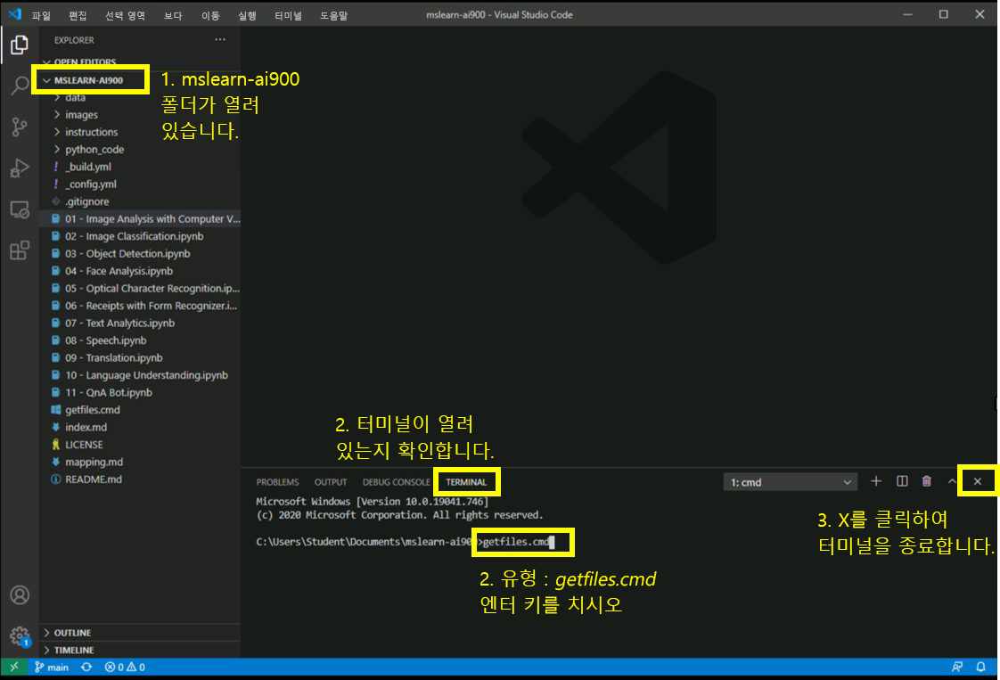

# AI-900 랩
## Visual Studio Code 사용

1.  Visual Studio Code를 시작합니다(프로그램 아이콘이 하단 작업 표시줄에 고정되어 있음). 열리면 왼쪽 패널에 MSLEARN-AI900 프로젝트가 표시됩니다.
2.  최신 버전의 프로젝트를 가져옵니다. 열려 있는 터미널에서 +++getfiles.cmd+++를 입력하고 **Enter** 키를 누릅니다. 이 명령은 최신 버전의 프로젝트를 폴더로 가져옵니다. 
3.  명령이 실행되면 터미널 창을 닫아도 됩니다. 이제 랩을 시작할 수 있습니다. 

